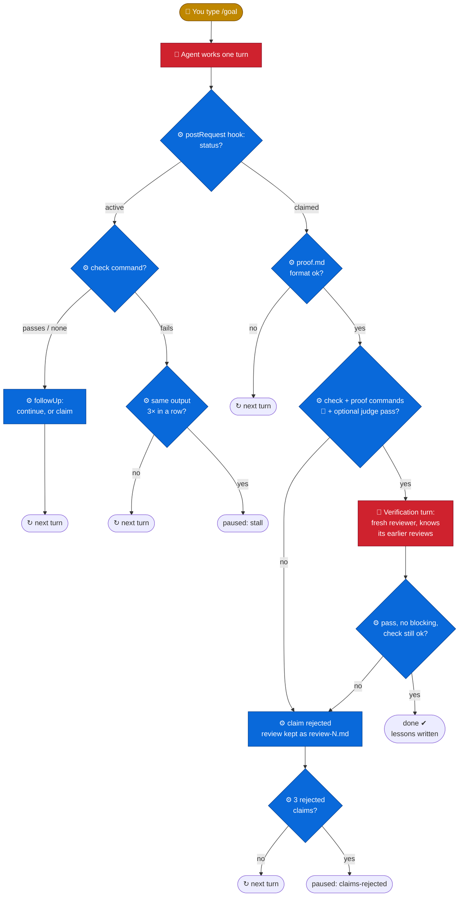

# eca-goal

A `/goal` command for [ECA](https://eca.dev) (Editor Code Assistant), similar to `/goal` in Claude Code.

> **Project status: incubation.** This is a very early proof of concept. Anything can change a lot, or break: the commands, the states, the file formats, how "done" is decided. Use it for experiments, not for work you depend on. Feedback is welcome.

You give the agent a goal. It keeps working, turn after turn, until the goal is met. It does not stop after each step to ask you.

```
/goal make all tests in the auth module pass
```

The agent decides when it **believes** the goal is met. The loop decides whether that belief holds. When the agent claims "done", it must write a proof. The loop then checks the claim: it runs the check command, re-runs the commands in the proof, and has a fresh reviewer (a subagent that did not see the chat) judge the rest. If any part fails, the agent goes back to work.

A shell check command is still the strongest proof, so use one when you can. But it is optional: a goal can also be "fluid" (docs, cleanup, design), and then the reviewer judges it.

## Why use it

- **Long, unattended work.** Give the agent a goal before lunch or at night. It works through it turn by turn, without "shall I continue?" stops.
- **The agent cannot grade its own work.** A claim of "done" must pass a check command, the proof commands (re-run by the hook), and a fresh reviewer that did not see the chat.
- **It knows when to stop.** Pauses on a stall, a broken check, too many rejected claims, the iteration budget, or when it needs you (credentials, an irreversible action).
- **It survives compaction and new chats.** The goal lives in a file and is re-injected after compaction. `/goal-resume` moves it to a new chat.
- **It gets better over time.** Every goal ends with lessons for your repo in `.eca/rules/`, which the next goal reads first.
- **Plain ECA.** Only custom commands and hooks (bash + `jq`). No fork, no plugin.

## How it works



👤 you · 🤖 LLM (the agent, or the fresh reviewer) · ⚙️ hook script. Every decision is made by a script; the LLM only works and reviews.

**↻ next turn** means: back to "Agent works one turn". The diagram shows the main path. The loop also pauses on `max_iterations`, when you stop a turn, when the agent needs a human, and on a check that cannot run (see [the pause reasons](docs/how-it-works.md#autonomy-and-when-it-stops)). [How it works](docs/how-it-works.md) has every step, including ownership and the goal re-injected after compaction.

## Quick start

Requires ECA (tested with **0.161.2**), `bash`, `jq` and GNU coreutils.

```bash
git clone https://github.com/brdloush/eca-goal.git
cd eca-goal
./install.sh --dry-run   # show what would change
./install.sh
```

Restart ECA (or reload the config). Run `/hooks`: you see the four `eca-goal-*` hooks. Turn on **trust mode**, or the loop waits for each tool approval. Note: the hook runs the goal's check and proof commands without asking you. See [Security](docs/how-it-works.md#security). Then type a goal:

```
/goal every public function in src/api/ has a docstring with an example; the tests still pass
```

The installer only adds eca-goal's own hooks to `config.json`, checks the JSON before and after, and keeps a backup. See [Install](docs/install.md) for details and uninstall.

## Commands

| Command | What it does |
|---------|--------------|
| `/goal <text>` | Start a goal. The agent asks questions if a "Done when" item is too vague. |
| `/goal-status` | Show status (and the pause reason), which chat owns the goal, iteration, `stall_count`, rejected claims, the check command, the reviewer's last verdict and the last progress. For a `done` goal, it says whether the loop confirmed it. Changes nothing. |
| `/goal-pause [reason]` | Pause the loop. |
| `/goal-resume [instructions]` | Resume the goal **in the current chat**, with a fresh iteration budget. Also use it to verify a `done` that the loop did not confirm. |

## Documentation

- [How it works](docs/how-it-works.md): every step, the goal types, pause reasons, safety rails, security, limits
- [Writing goals](docs/writing-goals.md): the state files, `goal.md`, the proof, writing a good check
- [Install](docs/install.md): requirements, what the installer changes, options, uninstall
- [Configuration](docs/configuration.md): `goal.md` keys, the optional LLM judge, environment variables
- [Development](docs/development.md): tests, files, the diagram

## License

[MIT](LICENSE)
